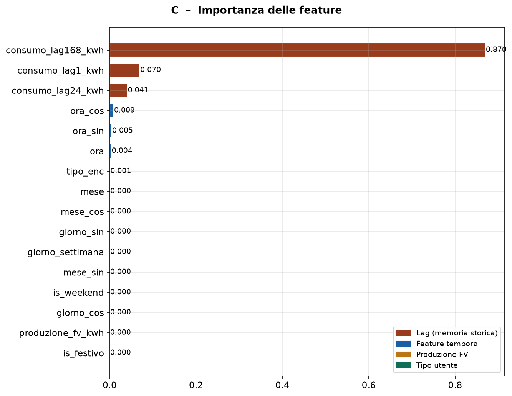
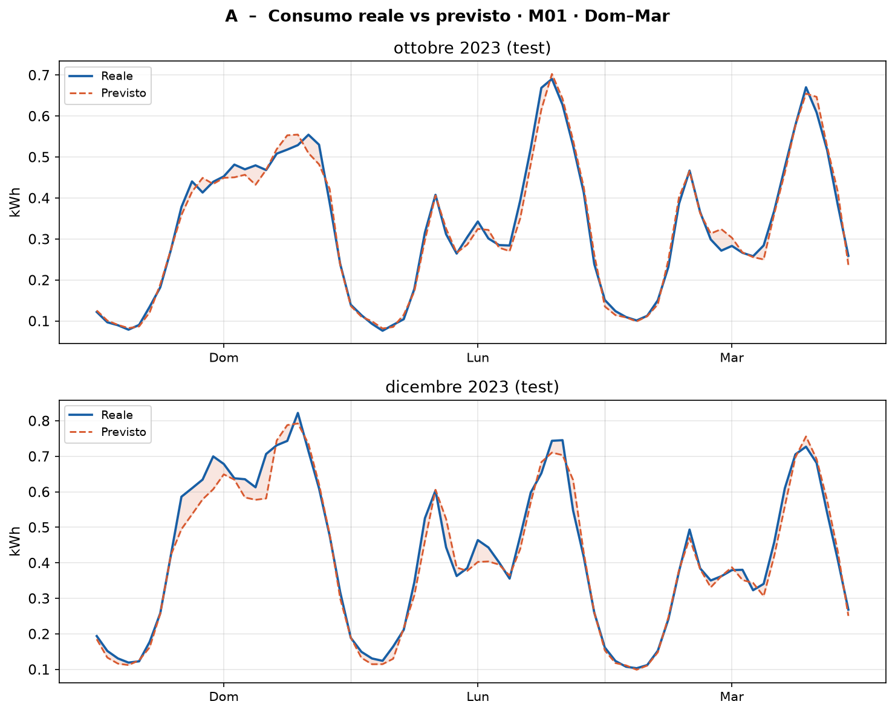
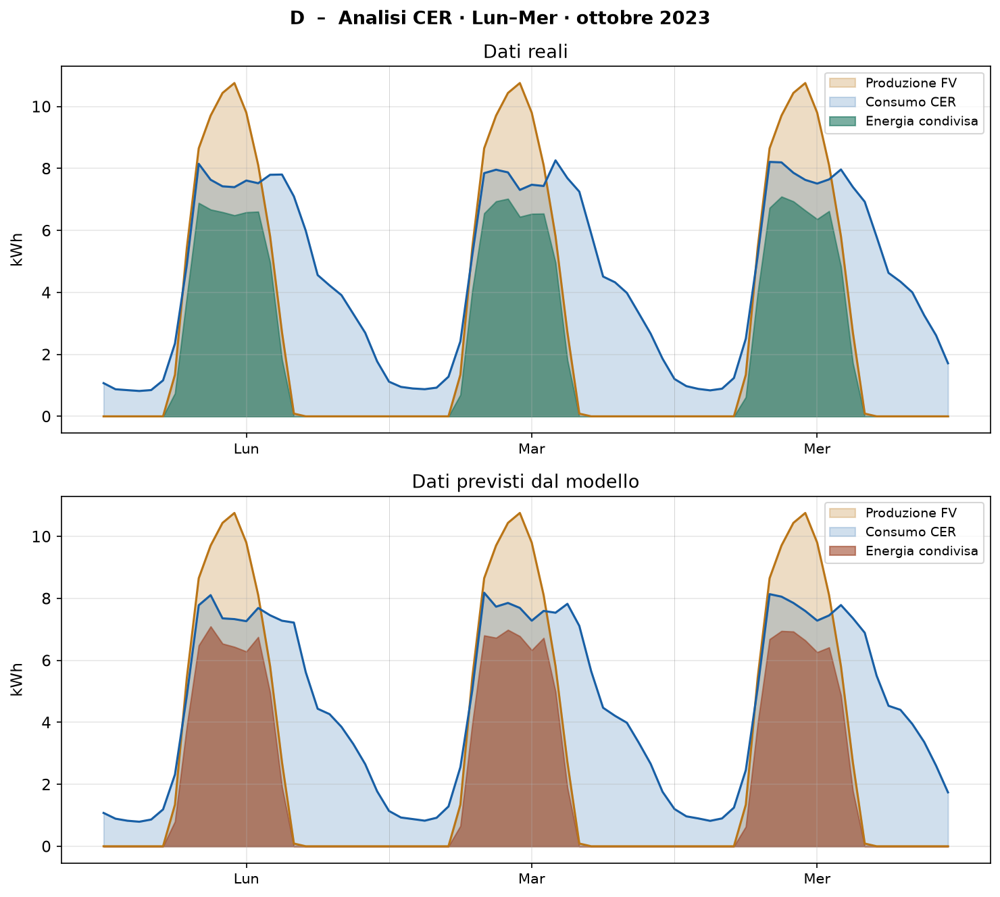
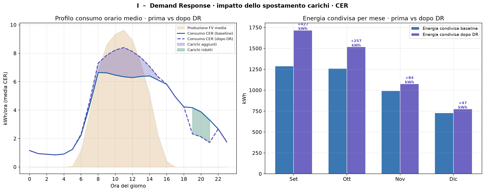

# Machine Learning for Renewable Energy Communities

**Bachelor's Thesis · Computer Engineering · Università degli Studi Guglielmo Marconi · 2026**

> Applying a **Random Forest Regressor** to forecast hourly energy consumption and optimize shared energy within a Renewable Energy Community (CER) in Benevento, Italy.

---

## Overview

This project develops a complete ML pipeline for a Renewable Energy Community of 8 members (residential prosumers, residential consumers, and a commercial user). The model forecasts individual hourly energy consumption and uses those forecasts to:

- Quantify shared energy and GSE incentive revenues under Italian regulation D.M. 414/2023
- Simulate a **Demand Response** strategy that shifts flexible loads to PV surplus hours
- Evaluate the economic impact of forecast errors on incentive accuracy

---

## Repository Structure

```
├── CER_ML_Analysis.ipynb          # Main pipeline: preprocessing, RF model, charts A–F
├── CER_Demand_Response.ipynb      # Demand Response simulation and load shifting
├── requirements.txt               # Pinned Python dependencies
├── LICENSE                        # MIT License
├── data/
│   ├── cer_consumi_orari.csv      # Hourly smart meter readings (2023, 8 users)
│   └── cer_members.csv            # Member registry (type, PV system capacity)
├── images/                        # Charts embedded in this README (A, C, D, I)
└── outputs/                       # Generated at runtime by the notebooks
    ├── cer_dataset_completo.csv   # Full feature-engineered dataset
    ├── cer_energia_condivisa.csv  # CER-level hourly aggregates
    ├── cer_previsioni.csv         # Model forecasts (test set: Sep–Dec)
    ├── cer_impatto_economico.csv  # Economic impact by month and GSE rate
    ├── cer_raccomandazioni_dr.csv # Demand Response recommendations per user
    └── grafico_*.png              # Generated charts (A–F, I)
```

---

## Methods

### Data Sources

| Source | Description |
| ------ | ----------- |
| Smart meters | Hourly consumption readings, 8 users, full year 2023 |
| [PVGIS API](https://re.jrc.ec.europa.eu/pvg_tools/en/) | Simulated PV production for 3 prosumer systems in Benevento (41.13°N, 14.78°E) |

### Feature Engineering

- **Temporal features** — hour, day of week, month with **cyclic sin/cos encoding** to preserve periodicity
- **Calendar flags** — `is_weekend`, `is_festivo` (Italian public holidays 2023)
- **Lag features** — consumption at t−1 h, t−24 h, t−168 h (same hour, previous week)
- **Energy flows** — self-consumption, grid injection, and residual demand per user

### Model

| Parameter          | Value                                    |
| ------------------ | ---------------------------------------- |
| Algorithm          | Random Forest Regressor (`scikit-learn`) |
| `n_estimators`     | 200                                      |
| `max_depth`        | 15                                       |
| `min_samples_leaf` | 4                                        |
| Train / Test split | Jan–Aug / Sep–Dec (temporal)             |
| Random seed        | 42                                       |

#### Feature Importance

<p align="center">
  
</p>

*Feature importance from the Random Forest. The dominant predictor is the **168-hour lag** (same hour, previous week) at **0.870**, confirming that weekly periodicity is the strongest signal for hourly household consumption. Short-term lags (1 h, 24 h) and cyclic encodings of the hour-of-day round out the relevant features — a finding consistent with the smart-meter forecasting literature.*

---

### CER Performance Indices

| Indicator                   | Value                         |
| --------------------------- | ----------------------------- |
| Total CER consumption       | 33,490 kWh/year               |
| Total PV production         | 30,801 kWh/year               |
| Individual self-consumption | 4,130 kWh/year (13.4%)        |
| Shared energy               | 14,952 kWh/year (48.5% of PV) |
| Consumption coverage        | 44.6%                         |

### Model Results

| Metric | Value      |
| ------ | ---------- |
| MAE    | 0.0262 kWh |
| RMSE   | 0.0544 kWh |
| R²     | 0.9935     |
| MAPE   | 5.35%      |

<p align="center">
  
</p>

*Predicted vs actual hourly consumption for member **M01**, test set (October and December 2023). The predicted curve (orange, dashed) closely tracks the real one (blue, solid) across both weekdays and weekends, including morning and evening consumption peaks — visual evidence of the R² 0.9935 reported above.*

Performance by user type:

| User type     | MAE    | R²     |
| ------------- | ------ | ------ |
| commercial    | 0.0515 | 0.9929 |
| consumer_res  | 0.0163 | 0.9794 |
| prosumer_res  | 0.0192 | 0.9776 |

Performance by time slot:

| Slot              | MAE    | R²     |
| ----------------- | ------ | ------ |
| Night (0–5)       | 0.0069 | 0.9348 |
| Morning (6–11)    | 0.0364 | 0.9932 |
| Afternoon (12–17) | 0.0404 | 0.9925 |
| Evening (18–23)   | 0.0211 | 0.9748 |

---

### CER-Level Forecast Accuracy

<p align="center">
  
</p>

*CER-level energy flows over three consecutive weekdays in October 2023: **PV production** (beige), **CER consumption** (light blue) and **shared energy** (green in the top panel = real, brown in the bottom panel = model prediction). The bottom panel demonstrates that the model preserves both the shape and the magnitude of shared-energy flows at the community level — not just at the individual user level — which is the metric that drives GSE incentive revenue.*

---

### Demand Response Simulation

The second notebook simulates a load-shifting strategy: flexible household appliances (washing machines, dishwashers, EV charging, etc.) are recommended to users during PV surplus hours. Each user receives a staggered time slot (offset by 1 hour) to avoid simultaneous load spikes.

The baseline shared energy (pre-DR, full-year analysis) is **14,952 kWh/year**, corresponding to a consumption coverage of **44.6%**. Applying Demand Response with 100% user adoption shifts consumption into daytime PV surplus hours, achieving a shared energy increase of over **+19%**. The economic impact of forecast errors on GSE incentives remains below **30 €/year**.

<p align="center">
  
</p>

*Demand Response impact on the CER. **Left:** average hourly consumption profile before (solid blue) and after (dashed purple) load shifting, overlaid on average PV production (beige). The purple-shaded area shows new daytime loads moved into PV surplus hours; the green-shaded area shows evening loads reduced as a consequence. **Right:** monthly shared-energy gain after DR, ranging from **+47 kWh** in December (low-irradiance month) to **+427 kWh** in September.*

---

## How to Run

Both notebooks are designed for **Google Colab**.

1. Open the notebook in Colab
2. Upload `cer_consumi_orari.csv` and `cer_members.csv` to the Colab session
3. Run all cells — the PVGIS API is called automatically
4. A download button appears at the end to save all outputs as a ZIP archive

> **Note:** for `CER_Demand_Response.ipynb`, also upload `cer_previsioni.csv` generated by the first notebook.
> **Internet access** is required for the PVGIS API calls in the first notebook.

---

## Regulatory Context

The economic analysis is based on the Italian CER incentive framework:

- **D.M. 414/2023** — sets the GSE incentive tariff for shared energy in Renewable Energy Communities
- **Base tariff used:** 100 €/MWh

---

## Thesis Reference

**Title:** *Machine Learning e Comunità Energetiche: Modelli per la Previsione e la Gestione Intelligente*
**Author:** Giovanni Verlingieri
**Institution:** Università degli Studi Guglielmo Marconi
**Year:** 2026
